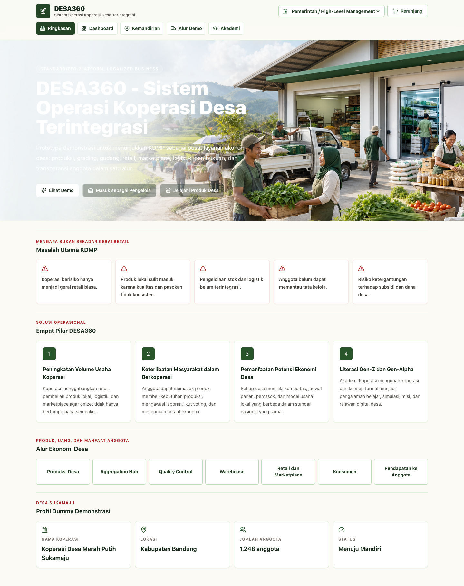
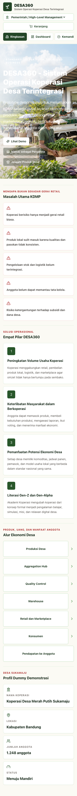

# DESA360 - Sistem Operasi Koperasi Desa Terintegrasi

DESA360 adalah MVP aplikasi web responsif untuk mendemonstrasikan bagaimana Koperasi Desa/Kelurahan Merah Putih dapat beroperasi sebagai pusat ekonomi desa, bukan hanya sebagai gerai retail biasa.

Konsep utama aplikasi ini adalah **Standardized Platform, Localized Business**: sistem, kontrol, standar mutu, pembukuan, dan indikator kinerja dibuat standar, sementara komoditas, harga, pemasok, layanan, dan model usaha menyesuaikan potensi desa.

## Siapa Penggunanya?

Dalam demo ini, pengguna utama adalah **presenter, evaluator program, pemerintah, pengelola KDMP, atau pihak yang ingin memahami alur bisnis koperasi desa**.

Aplikasi menyediakan role switcher sehingga pengguna dapat melihat sistem dari beberapa sudut pandang:

- Petani / Nelayan / UMKM
- Pengelola Koperasi
- Konsumen / Pembeli
- Anggota Koperasi
- Manajer Wilayah / Agrinas
- Pemerintah / High-Level Management

## Alur Penggunaan Demo

1. Buka halaman **Ringkasan** untuk menjelaskan masalah KDMP dan solusi DESA360.
2. Masuk ke **Alur Demo** untuk menjalankan skenario 500 kg cabai dari petani sampai pembayaran.
3. Ganti role ke **Petani / Nelayan / UMKM** untuk melihat pendaftaran hasil produksi, status produk, harga, dan pembayaran.
4. Ganti role ke **Pengelola Koperasi** untuk melihat verifikasi, grading, inventory, cold storage, logistik, retail mix, dan pembukuan.
5. Ganti role ke **Konsumen / Pembeli** untuk melihat marketplace, traceability produk, keranjang, dan checkout.
6. Ganti role ke **Anggota Koperasi** untuk melihat transparansi laporan, voting digital, dan forum usulan.
7. Ganti role ke **Manajer Wilayah** atau **Pemerintah** untuk melihat risiko, dampak program, subsidi, dan skor kemandirian koperasi.

## Fitur Utama

- Landing page konsep DESA360
- Role-based dashboard
- Supplier intake dan quality grading
- Inventory, warehouse, dan cold storage
- Logistics scheduler
- Marketplace produk desa
- Traceability produk
- Transparansi keuangan anggota
- Voting digital dan forum usulan
- Dashboard wilayah dan pemerintah
- Cooperative Independence Score
- Simulasi keberlanjutan setelah subsidi selesai
- Akademi Koperasi untuk Gen-Z dan Gen-Alpha

## Contoh Screenshot

### Desktop



### Mobile



## Cara Menjalankan

Pastikan Node.js dan pnpm tersedia, lalu jalankan:

```bash
pnpm install
pnpm dev
```

Build production:

```bash
pnpm build
```

Smoke test lokal:

```bash
pnpm exec playwright install chromium
node scripts/smoke-test.mjs http://127.0.0.1:5173/
```

## Struktur Folder

```text
.
├── docs/screenshots/        # Screenshot contoh untuk GitHub
├── public/assets/           # Asset visual aplikasi
├── scripts/                 # Script smoke test
├── src/
│   ├── components/          # Komponen UI reusable
│   ├── data/                # Data dummy lokal DESA360
│   ├── types/               # TypeScript types
│   └── utils/               # Helper format
├── package.json
├── pnpm-lock.yaml
└── README.md
```

## Catatan

Aplikasi ini adalah prototype demonstrasi, bukan sistem produksi. Semua data yang digunakan adalah data dummy realistis untuk kebutuhan presentasi dan eksplorasi alur bisnis KDMP.
